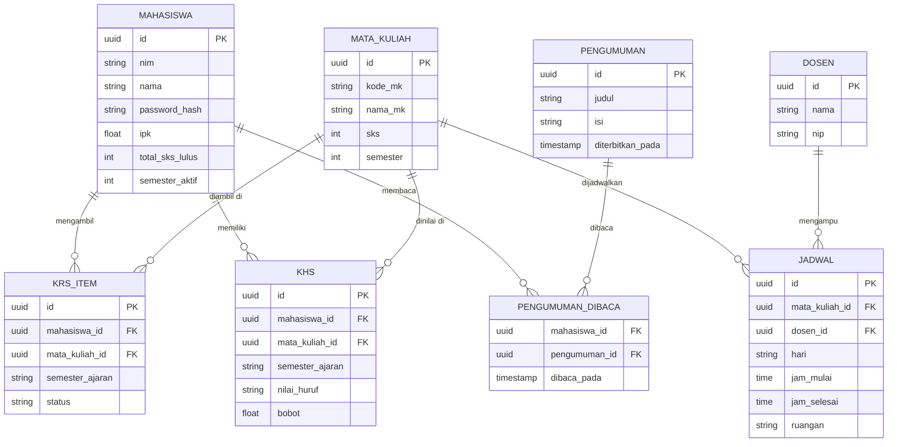
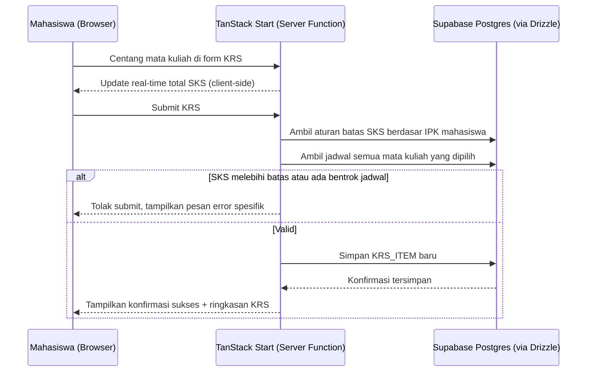

# PRD: Akadesi — Redesign Konsep SIAKAD Mahasiswa

**Status:** Draft
**Author:** Claude atas permintaan Umam
**Tanggal:** 18 Juli 2026
**Versi:** 0.1

## 1. Overview

Akadesi adalah proyek konsep redesign Sistem Informasi Akademik (SIAKAD) mahasiswa, terinspirasi dari SISAKAD YARSI yang desainnya dinilai sudah jadul dan pernah gagal diperbarui lewat proyek vendor sebelumnya (SIAK YARSI). Akadesi dibangun sebagai proyek portofolio mandiri untuk menunjukkan kemampuan redesign UI/UX yang modern sekaligus arsitektur teknis yang matang dan performant, menggunakan TanStack Start, Supabase, Drizzle ORM, dan Tailwind CSS. Versi MVP berfokus pada role Mahasiswa saja.

## 2. Problem Statement

SIAKAD di kampus Umam (SISAKAD YARSI) memiliki tampilan yang sudah usang: layout berbasis tabel HTML padat, minim hierarki visual, dan interaksi yang terasa kaku (khas stack PHP + jQuery + DataTables generasi lama). Upaya modernisasi sebelumnya (proyek SIAK YARSI) gagal berjalan karena masalah vendor, sehingga sistem lama tetap dipakai hingga sekarang.

Dari sisi pengguna (mahasiswa), masalah konkret yang muncul dari tampilan lama ini biasanya:

- Sulit membaca jadwal dan status akademik secara sekilas (tidak ada ringkasan/dashboard, langsung tabel mentah)
- Proses KRS terasa menyiksa dari sisi UX (form panjang, tidak ada feedback visual jelas soal SKS terpakai/sisa)
- Tidak ada tempat terpusat untuk pengumuman/informasi penting dari kampus

Karena LDAP kampus asli tidak bisa diakses publik, proyek ini didemokan menggunakan data tiruan (mock/seed), sambil tetap mendokumentasikan bagaimana integrasi LDAP+Laravel akan bekerja di skenario produksi sungguhan.

## 3. Goals & Non-Goals

**Goals:**

- Menghadirkan ulang alur inti SIAKAD mahasiswa (dashboard, jadwal, KRS, KHS, pengumuman) dengan UI yang bersih, modern, dan konsisten
- Menunjukkan arsitektur full-stack yang performant: rendering di server (TanStack Start), data via Postgres (Supabase) + Drizzle ORM
- Membuat proyek yang bisa diakses publik sebagai demo portofolio, dengan data mock yang realistis, menggunakan akun dummy agar website bisa langsung berfungsi tanpa bergantung pada LDAP

**Non-Goals (sengaja di luar scope MVP ini):**

- Role Dosen dan Tendik (dashboard input nilai, approval, dsb) — direncanakan untuk fase berikutnya
- Integrasi LDAP sungguhan — MVP memakai mock login dengan akun dummy yang di-seed
- Proses pembayaran/keuangan mahasiswa
- Fitur bimbingan akademik/konsultasi dosen wali
- Aplikasi mobile native (fokus web responsive dulu)

## 4. Target User / Persona

**Mahasiswa** (satu-satunya role di MVP ini):

- Mahasiswa aktif yang perlu memantau jadwal kuliah, mengambil KRS tiap semester, melihat riwayat nilai (KHS/transkrip), dan mendapat info pengumuman kampus.
- Konteks pemakaian: sering diakses lewat HP (jaringan kampus/asrama bervariasi), dan diakses bersamaan oleh banyak mahasiswa saat periode sibuk (misal awal semester KRS).

Untuk keperluan demo publik, persona ini direpresentasikan lewat beberapa akun dummy yang sudah di-seed (misal 2-3 mahasiswa dengan data akademik berbeda, biar variasi tampilan terlihat).

## 5. User Stories & Acceptance Criteria

### US-1: Login dengan akun mock

Sebagai mahasiswa (demo), saya ingin login menggunakan akun dummy yang disediakan, supaya saya bisa mencoba sistem tanpa perlu akun LDAP asli.

**Acceptance Criteria:**

- Given halaman login, When mahasiswa memasukkan kredensial dummy yang valid (NIM + password seed), Then diarahkan ke dashboard dan session tersimpan lewat httpOnly cookie
- Given kredensial salah, When submit, Then muncul pesan error yang jelas tanpa membocorkan apakah NIM atau password yang salah
- Given belum login, When mengakses route apa pun di bawah `/mahasiswa`, Then diarahkan otomatis ke halaman login

### US-2: Melihat Dashboard ringkasan

Sebagai mahasiswa, saya ingin melihat ringkasan status akademik saya begitu login, supaya saya tidak perlu mencari informasi tersebar di banyak halaman.

**Acceptance Criteria:**

- Given sudah login, When membuka dashboard, Then tampil IPK terkini, total SKS lulus, jadwal kuliah hari ini, dan 3 pengumuman terbaru
- Given data sedang dimuat, When halaman pertama kali dibuka, Then tampil skeleton loading, bukan halaman kosong/blank
- Given mahasiswa belum punya jadwal hari ini (misal libur), When membuka dashboard, Then tampil empty state yang informatif ("Tidak ada jadwal kuliah hari ini")

### US-3: Melihat Jadwal Kuliah

Sebagai mahasiswa, saya ingin melihat jadwal kuliah mingguan dalam tampilan yang mudah dibaca, supaya saya tidak perlu menghitung dari tabel mentah.

**Acceptance Criteria:**

- Given sudah login, When membuka halaman Jadwal, Then jadwal ditampilkan per hari (Senin-Minggu) dengan info mata kuliah, jam, ruangan, dan dosen pengampu
- Given mahasiswa memilih hari tertentu, When switch antar hari, Then transisi tidak me-reload seluruh halaman (client-side state)

### US-4: Mengisi KRS

Sebagai mahasiswa, saya ingin memilih mata kuliah untuk semester berjalan dengan validasi SKS otomatis, supaya saya tidak salah ambil melebihi batas SKS yang diizinkan.

**Acceptance Criteria:**

- Given halaman KRS, When mahasiswa mencentang mata kuliah, Then total SKS terpakai ter-update real-time dan dibandingkan dengan batas SKS maksimum (berdasarkan IPK semester lalu)
- Given total SKS melebihi batas maksimum, When mencoba submit, Then submit diblokir dan muncul pesan error yang menyebutkan batas SKS yang berlaku
- Given ada jadwal bentrok antar mata kuliah yang dipilih, When mencentang mata kuliah yang bentrok, Then sistem menandai bentrok tersebut secara visual sebelum submit
- Given KRS berhasil disimpan, When submit sukses, Then muncul konfirmasi dan mahasiswa bisa melihat ringkasan KRS yang sudah diambil

### US-5: Melihat KHS/Transkrip

Sebagai mahasiswa, saya ingin melihat riwayat nilai per semester dan progres SKS kumulatif, supaya saya bisa memantau perkembangan akademik saya.

**Acceptance Criteria:**

- Given halaman KHS, When memilih semester tertentu, Then tampil daftar mata kuliah beserta nilai huruf, bobot, dan IP semester tersebut
- Given mahasiswa berada di halaman transkrip keseluruhan, When halaman dimuat, Then tampil grafik/visual progres SKS kumulatif terhadap total SKS kelulusan

### US-6: Melihat Pengumuman

Sebagai mahasiswa, saya ingin melihat pengumuman/informasi dari kampus di satu tempat, supaya saya tidak ketinggalan info penting.

**Acceptance Criteria:**

- Given halaman Pengumuman, When dibuka, Then daftar pengumuman tampil terurut dari yang terbaru, dengan indikator sudah/belum dibaca
- Given tidak ada pengumuman baru, When halaman dibuka, Then tampil empty state yang sesuai

## 6. Functional Requirements

- Sistem harus memvalidasi session lewat httpOnly cookie di setiap route yang memerlukan auth (dicek di server, bukan hanya di client)
- Perhitungan batas SKS maksimum mengikuti aturan umum akademik: IPK ≥ 3.00 → maksimum 24 SKS, IPK 2.50–2.99 → maksimum 21 SKS, IPK < 2.50 → maksimum 18 SKS (nilai ambang ini bisa disesuaikan di konfigurasi, karena aturan riil tiap kampus bisa berbeda — lihat Open Questions)
- Deteksi bentrok jadwal KRS dilakukan dengan membandingkan rentang hari+jam antar mata kuliah yang dipilih mahasiswa
- Semua form (login, KRS) divalidasi baik di client (feedback cepat) maupun di server function/API route (validasi sungguhan, tidak bisa dilewati dari client)
- Data akademik (KHS, transkrip, jadwal, pengumuman) untuk mode demo disediakan lewat seed script Drizzle, bukan input manual per pengguna

## 7. Technical Design

### 7.1 Tech Stack & Constraints

- **Framework:** TanStack Start (full-stack React — routing, server functions, API routes, SSR/streaming)
- **Database:** Supabase (Postgres) — dipilih dengan catatan: proyek harus dijaga tetap "aktif" (query berkala) untuk menghindari auto-pause di free tier setelah ~1 minggu idle. _(Catatan: pada pembahasan sebelumnya sempat direkomendasikan Neon karena perilaku scale-to-zero yang otomatis bangun tanpa intervensi manual — karena keputusan akhir user menetapkan Supabase, ini dicatat sebagai risiko operasional di bagian Risks & Assumptions, bukan diubah tanpa konfirmasi.)_
- **ORM:** Drizzle ORM — schema-first, type-safe query builder
- **Styling:** Tailwind CSS dengan custom token system bergaya `primary-*` (konsisten dengan konvensi yang sudah dipakai Umam di proyek PentaDosen)
- **Icon:** lucide-react
- **Animasi:** framer-motion (`motion/react`)
- **Deployment:** Vercel (frontend + server functions TanStack Start)
- **Auth (MVP):** Mock login dengan akun dummy yang di-seed ke database, session disimpan di httpOnly cookie. Tidak ada integrasi LDAP/Laravel sungguhan di MVP ini — didokumentasikan sebagai arsitektur masa depan (lihat Open Questions).

### 7.2 Data Model



### 7.3 API / Interface Design

Menggunakan kombinasi **server function** (untuk aksi terikat form/halaman tertentu) dan **API routes** (untuk data yang bisa dipanggil ulang via TanStack Query di client):

| Endpoint / Server Function           | Method | Auth                                   | Deskripsi                                                                   |
| ------------------------------------ | ------ | -------------------------------------- | --------------------------------------------------------------------------- |
| `loginFn` (server function)          | POST   | Tidak (ini endpoint login itu sendiri) | Validasi NIM+password dummy, set httpOnly cookie                            |
| `logoutFn` (server function)         | POST   | Ya                                     | Hapus cookie session                                                        |
| `/api/mahasiswa/dashboard`           | GET    | Ya                                     | Ringkasan IPK, SKS, jadwal hari ini, 3 pengumuman terbaru                   |
| `/api/mahasiswa/jadwal`              | GET    | Ya                                     | Jadwal kuliah mingguan mahasiswa yang login                                 |
| `/api/mahasiswa/krs`                 | GET    | Ya                                     | Daftar mata kuliah yang tersedia semester berjalan + KRS yang sudah diambil |
| `/api/mahasiswa/krs`                 | POST   | Ya                                     | Submit KRS baru (validasi SKS max + bentrok jadwal di server)               |
| `/api/mahasiswa/khs`                 | GET    | Ya                                     | Riwayat nilai per semester + transkrip kumulatif                            |
| `/api/mahasiswa/pengumuman`          | GET    | Ya                                     | Daftar pengumuman + status dibaca/belum                                     |
| `/api/mahasiswa/pengumuman/:id/read` | POST   | Ya                                     | Tandai pengumuman sudah dibaca                                              |

Semua endpoint bertipe `GET`/`POST` di atas memeriksa cookie session di server sebelum memproses (lewat `beforeLoad` di root route yang di-guard, sesuai pola yang dibahas sebelumnya).

### 7.4 Component / File Structure

```
src/
├── routes/
│   ├── __root.tsx
│   ├── login.tsx
│   ├── _authenticated/
│   │   ├── route.tsx                # guard auth, cek cookie session
│   │   └── mahasiswa/
│   │       ├── dashboard.tsx
│   │       ├── jadwal.tsx
│   │       ├── krs.tsx
│   │       ├── khs.tsx
│   │       └── pengumuman.tsx
│   └── api/
│       └── mahasiswa/
│           ├── dashboard.ts
│           ├── jadwal.ts
│           ├── krs.ts
│           ├── khs.ts
│           └── pengumuman.ts
├── components/
│   ├── ui/                          # komponen dasar (Button, Badge, Card, dsb — token primary-*)
│   ├── dashboard/
│   │   ├── RingkasanAkademik.tsx
│   │   ├── JadwalHariIni.tsx
│   │   └── PengumumanTerbaru.tsx
│   ├── jadwal/
│   │   └── JadwalMingguan.tsx
│   ├── krs/
│   │   ├── DaftarMataKuliah.tsx
│   │   ├── RingkasanSks.tsx
│   │   └── PeringatanBentrok.tsx
│   ├── khs/
│   │   ├── TabelNilaiSemester.tsx
│   │   └── GrafikProgresSks.tsx
│   └── pengumuman/
│       └── DaftarPengumuman.tsx
├── db/
│   ├── schema.ts                    # skema Drizzle sesuai ERD di atas
│   └── seed.ts                      # seed data dummy mahasiswa + akademik
├── lib/
│   ├── auth.ts                      # helper cookie/session
│   └── sks-rules.ts                 # logic aturan batas SKS
└── server/
    └── functions/
        ├── loginFn.ts
        └── logoutFn.ts
```

### 7.5 Sequence / Flow — Alur Submit KRS



## 8. UI/UX Notes

- **Loading state:** skeleton loading di dashboard, jadwal, KRS, dan KHS — bukan spinner generik, mengikuti bentuk layout asli (skeleton card, skeleton row tabel) supaya tidak ada layout shift saat data selesai dimuat
- **Empty state:** tiap halaman (jadwal kosong, pengumuman kosong, KRS belum dibuka) punya pesan + ilustrasi/icon yang sesuai konteks, bukan halaman blank
- **Error state:** kegagalan fetch data (misal Supabase idle/cold start) menampilkan pesan retry yang jelas, bukan crash halaman putih
- **Desain visual:** tidak memakai efek glow atau gradient (sesuai preferensi desain yang konsisten di proyek-proyek Umam sebelumnya), berbasis card layout dengan whitespace lega dan badge warna lembut untuk status (bukan teks merah-hijau mentah)
- **Responsif:** prioritas mobile-first karena mahasiswa dominan akses lewat HP

## 9. Edge Cases & Error Handling

- **Cold start Supabase/database idle:** request pertama setelah idle lama mungkin lambat — tampilkan skeleton loading yang bertahan sedikit lebih lama alih-alih dianggap error prematur
- **Submit KRS ganda (double click):** tombol submit di-disable begitu diklik pertama kali sampai response server diterima, mencegah duplikasi data
- **Session/cookie kedaluwarsa saat mengisi form panjang (KRS):** jika session expired saat submit, tampilkan pesan yang jelas dan arahkan ke login tanpa kehilangan pilihan mata kuliah yang sudah dicentang (simpan sementara di state client sebelum redirect)
- **Data mahasiswa dummy tidak lengkap (misal IPK null untuk mahasiswa semester 1):** batas SKS default mengikuti aturan mahasiswa baru (misal maksimum 18-20 SKS tanpa syarat IPK)
- **Akses langsung ke URL role lain (misal `/dosen/...`) oleh akun mahasiswa:** redirect ke dashboard mahasiswa atau halaman 403, bukan render kosong

## 10. Success Metrics

Karena ini proyek portofolio (bukan produk dengan traffic riil), metrik keberhasilan bersifat kualitatif dan teknis, bukan bisnis:

- Semua 6 user story (US-1 s/d US-6) berjalan sesuai acceptance criteria di atas tanpa bug blocking
- Lighthouse Performance score ≥ 90 untuk halaman dashboard dan jadwal di kondisi jaringan standar
- Waktu render awal (First Contentful Paint) halaman dashboard < 1.5 detik pada koneksi 4G standar
- Demo bisa diakses publik tanpa perlu manual intervention (database tidak stuck di status paused)

## 11. Risks & Assumptions

**Asumsi:**

- Aturan batas SKS berdasarkan IPK yang dipakai di functional requirement adalah aturan umum, bukan aturan resmi YARSI — perlu dikonfirmasi/disesuaikan kalau Umam tahu aturan riil kampus
- Data akademik yang ditampilkan sepenuhnya dummy/seed, tidak merepresentasikan data mahasiswa sungguhan
- Autentikasi LDAP dikesampingkan sepenuhnya dari scope kerja saat ini — sistem dibangun dan diuji coba menggunakan akun dummy/mock agar website bisa berfungsi penuh tanpa bergantung pada integrasi LDAP

**Risiko:**

- **Supabase auto-pause:** proyek di free tier Supabase bisa di-pause otomatis setelah sekitar 1 minggu tanpa aktivitas, yang butuh unpause manual dari dashboard — ini berisiko bikin demo publik tidak bisa diakses sewaktu-waktu tanpa Umam sadar. Mitigasi: bisa menambahkan cron job/ping berkala (misal lewat GitHub Actions) untuk menjaga project tetap aktif, atau mempertimbangkan pindah ke Neon di masa depan kalau masalah ini sering terjadi
- **Scope creep:** karena ini proyek personal tanpa deadline ketat, ada risiko fitur terus bertambah sebelum MVP selesai — disarankan strict berpegang pada 6 user story di atas untuk rilis pertama
- **Ekosistem TanStack Start relatif baru:** dokumentasi dan referensi komunitas masih lebih sedikit dibanding Next.js, berpotensi memperlambat development saat menemui kasus edge yang jarang terdokumentasi

## 12. Timeline / Milestones

- **Fase 1 — Fondasi:** setup project TanStack Start + Tailwind token system, schema Drizzle + Supabase, seed data dummy, mock login
- **Fase 2 — Fitur inti:** Dashboard, Jadwal, KRS (termasuk validasi SKS & bentrok), KHS
- **Fase 3 — Pelengkap:** Pengumuman + status dibaca, polish UI/UX (loading/empty/error state), animasi framer-motion
- **Fase 4 — Deploy & hardening:** deploy ke Vercel, uji performa (Lighthouse), dokumentasi arsitektur (termasuk penjelasan integrasi LDAP di skenario produksi)
